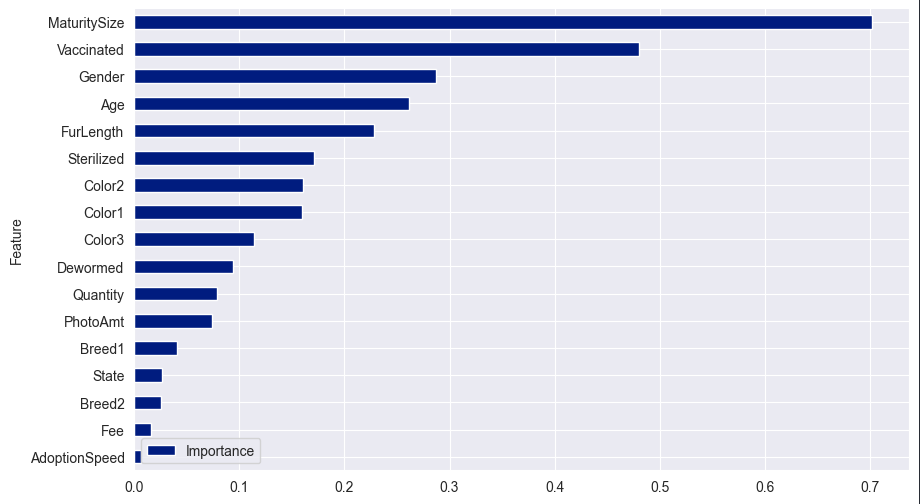
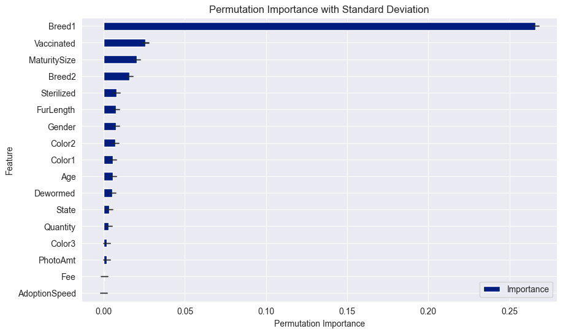

The projects contains the following folders :-

1_LabEnhancements_PCA
2_LabEnhancements_LinearRegression
3_LabEnhancements_LogisticRegression
4_LabEnhancements_Kmeans
5_Project

The contribution list is as follows :-

**GROUP Lab Enhancement**
- Anis Hazirah binti Mohamad Sabry (1211300373) - PCA 
- Nuha Awadah binti Mohd Yusof (1211303209) - Linear Regression
- Muhammad Lutfi bin Mohd Izzat (1201100521) - Logistic Regression
- Ong Shi Yi (1201101485) - K-Means

**GROUP Project**
- Anis Hazirah binti Mohamad Sabry (1211300373) - Data Preparation, Exploratory Data Analysis, PCA Implementation
- Nuha Awadah binti Mohd Yusof (1211303209) - Linear Regression
- Muhammad Lutfi bin Mohd Izzat (1201100521) - Logistic Regression, Adoption Prediction Analysis
- Ong Shi Yi (1201101485) - K-Means

# Pet Finders Analysis

## Overview of Project
The project is done in hopes to find the likelihood of adoption between cats and dogs, and what features that 
can increase it's chance for adoption.

## Objectives: 
1. Between cats and dogs, which of these animals are more likely to get adopted?
2. What features can increase the likelihood of adoption?

## Motivation : 
There undeniably an absurd amount of stray animals on the street, so what enchances their appeal for adoption? This project investigates the compenents that make up these adorable fur-balls, and which of these features would get them their forever home.

## Video Submission
The video link is down below.

https://youtu.be/a6PTJ9n5Lrc

## Prediction Analysis

for the dataset, the graph (taken from LogisticRegression) below shows how important a feature is for the likelihood of adoption for both cats and dogs. It can be seen that maturitysize matters the most in a lot of cases, followed by wether or not the animal is vaccinated, and then by gender, age and fur length.

Most of the features shown are genetic-based, except for the vaccination feature. With this, the chances of a cat or a dog being adopted can be further increased by vaccinating the animal.

<table>
  <tr>
    <td></td>
    <td></td>
  </tr>
  <tr>
